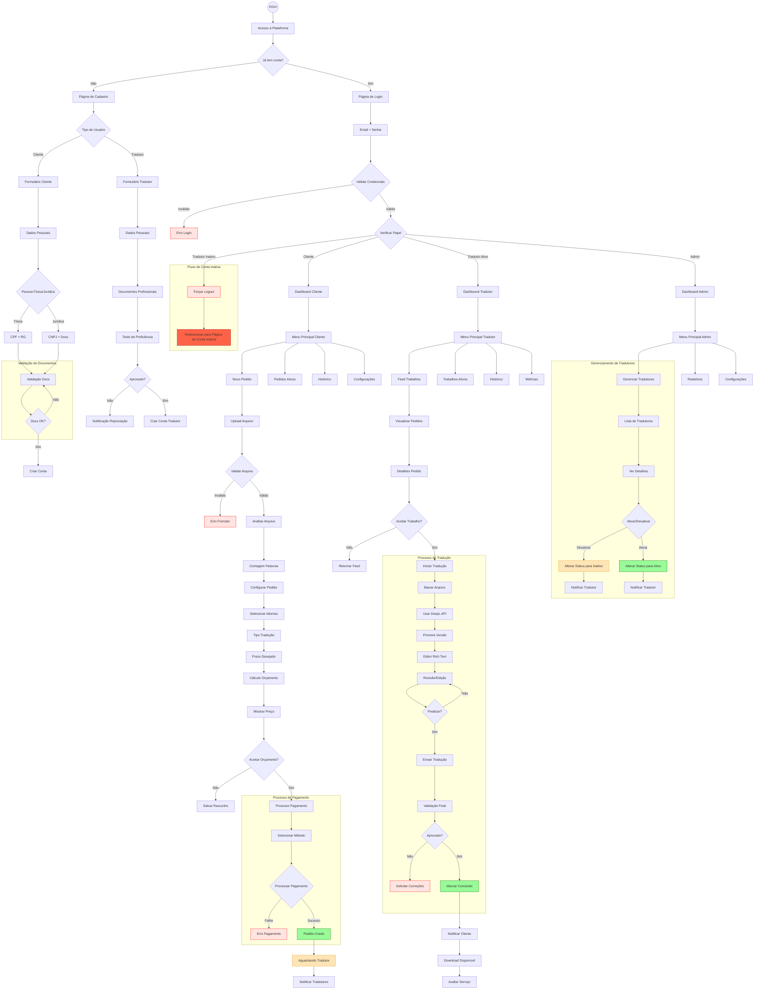

# Fluxo do Usuário - Plataforma de Tradução

## Legenda

🔴 Erro/Falha
🟢 Sucesso/Concluído
🟡 Em Andamento/Aguardando
🟣 Processo em Execução
🔵 Validação
🟠 Bloqueado/Inativo

## Notas
1. **Tipos de Arquivos Suportados**
   - Documentos: PDF, DOCX, DOC
   - Planilhas: XLS, XLSX
   - Apresentações: PPT, PPTX
   - Imagens: JPG, PNG

2. **Tipos de Tradução**
   - Juramentada
   - Técnica
   - Certificada
   - Comum

3. **Estados do Sistema**
   - Aguardando Pagamento
   - Aguardando Tradutor
   - Em Tradução
   - Em Revisão
   - Concluído
   - Cancelado

4. **Papéis de Usuário**
   - Cliente: Solicita e gerencia traduções
   - Tradutor Ativo: Realiza traduções e aceita trabalhos
   - Tradutor Inativo: Bloqueado de acessar o sistema (redirecionado para página específica)
   - Administrador: Gerencia sistema, usuários e monitora atividades

5. **Validações Importantes**
   - Documentos de identificação
   - Formatos de arquivo
   - Tamanho máximo de arquivo
   - Qualificações do tradutor
   - Qualidade da tradução
   - Status do tradutor (ativo/inativo)

6. **Fluxo de Segurança para Contas Inativas**
   - Detecção de conta inativa durante login
   - Forçar logout imediato
   - Redirecionamento para página dedicada
   - Mensagem clara sobre status da conta
   - Contato direto com suporte para reativação

7. **Integrações**
   - DeepL API para auxílio na tradução
   - Gateway de pagamento
   - Sistema de notificações
   - Sistema de armazenamento (Supabase Storage)
